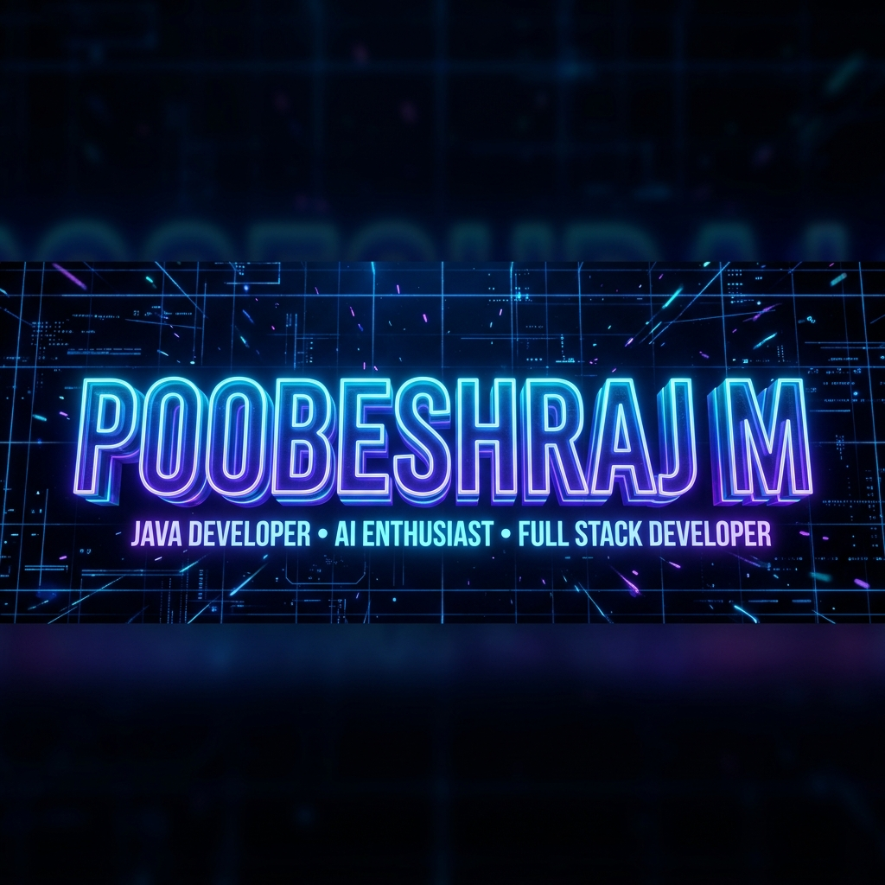
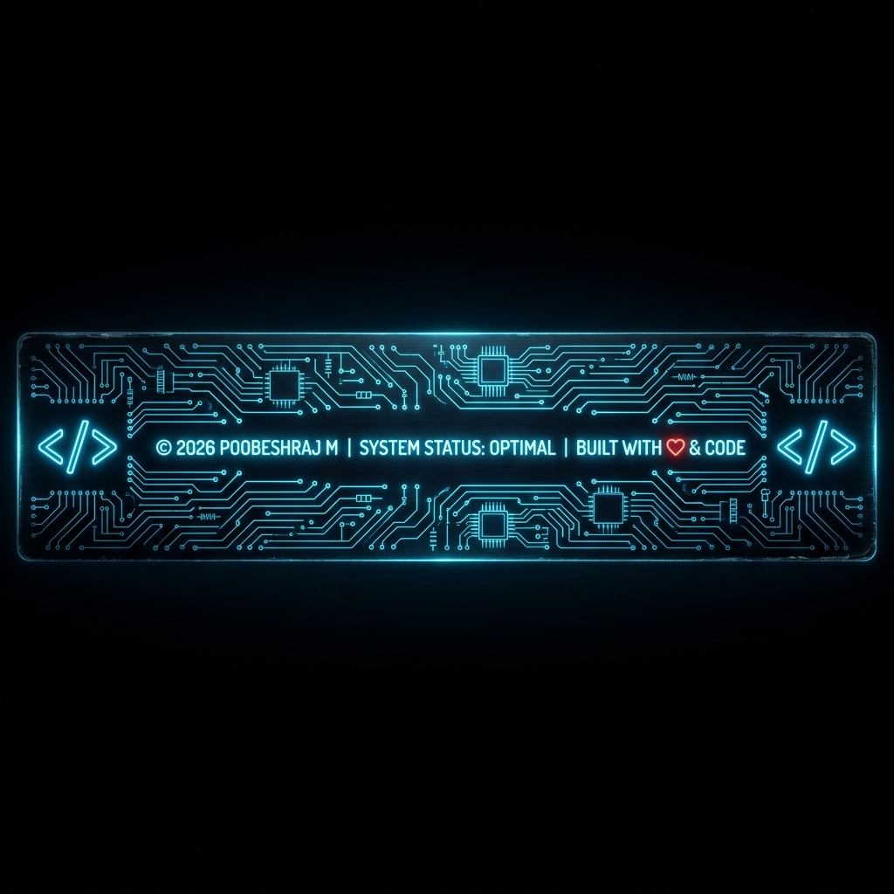

<div align="center">

<!-- ══════════════════════════════════════════════════════════ -->
<!--                   3D NEON BANNER                          -->
<!-- ══════════════════════════════════════════════════════════ -->



<br/>

<!-- TYPING SVG ANIMATION -->
[](https://git.io/typing-svg)

<br/>

<!-- PROFILE VIEWS -->

&nbsp;
[](https://github.com/Poobeshraj-M)
&nbsp;
[](https://github.com/Poobeshraj-M)

</div>

---

<!-- ══════════════════════════════════════════════════════════ -->
<!--                    SYSTEM BIO                             -->
<!-- ══════════════════════════════════════════════════════════ -->

<table>
<tr>
<td width="50%" valign="top">

```yaml
╔══════════════════════════════════╗
║         SYSTEM BIO               ║
╚══════════════════════════════════╝

  Name       : POOBESHRAJ M
  Username   : Poobeshraj-M
  Role       : Java Dev & AI Engineer
  Location   : India
  Status     : 🟢 ONLINE & BUILDING
  Focus      : AI Solutions + Full Stack
```

</td>
<td width="50%" valign="top">

```yaml
╔══════════════════════════════════╗
║         CURRENT MISSIONS         ║
╚══════════════════════════════════╝

  🔭 Building Autonomous AI Agents
  🤖 Mastering Multi-Agent Frameworks
  💡 Exploring LLMs, RAG & GenAI
  🧩 Solving DSA daily in Java
  ⚡ Fun fact: AI runs on my coffee!
```

</td>
</tr>
</table>

---

<!-- ══════════════════════════════════════════════════════════ -->
<!--               GITHUB STATS                                -->
<!-- ══════════════════════════════════════════════════════════ -->

<div align="center">

### 📊 GitHub Stats


&nbsp;&nbsp;


</div>

<br/>

<div align="center">

### 🔥 Streak Stats

[](https://git.io/streak-stats)

</div>

---

<!-- ══════════════════════════════════════════════════════════ -->
<!--               LEETCODE STATS                              -->
<!-- ══════════════════════════════════════════════════════════ -->

<div align="center">

### ⚔️ LeetCode Arena

<a href="https://leetcode.com/u/Poobeshraj/" target="_blank">
  
</a>

<br/><br/>

<table>
  <thead>
    <tr>
      <th>Metric</th>
      <th>Value</th>
      <th>Difficulty</th>
      <th>Solved</th>
      <th>Total</th>
    </tr>
  </thead>
  <tbody>
    <tr>
      <td>🎯 Total Solved</td>
      <td><code>165 / 3991</code></td>
      <td>🟢 Easy</td>
      <td><strong>114</strong></td>
      <td>954</td>
    </tr>
    <tr>
      <td>🌍 Global Rank</td>
      <td><code>#997,728</code></td>
      <td>🟡 Medium</td>
      <td><strong>44</strong></td>
      <td>2084</td>
    </tr>
    <tr>
      <td>🔗 Profile</td>
      <td><a href="https://leetcode.com/u/Poobeshraj/">View →</a></td>
      <td>🔴 Hard</td>
      <td><strong>7</strong></td>
      <td>953</td>
    </tr>
  </tbody>
</table>

</div>

---

<!-- ══════════════════════════════════════════════════════════ -->
<!--              CORE TECHNOLOGIES                            -->
<!-- ══════════════════════════════════════════════════════════ -->

<div align="center">

### 🛠️ Core Technologies

[](https://skillicons.dev)

</div>

<br/>

<div align="center">

| 🌐 Frontend | ⚙️ Backend | 🤖 AI / ML | ☁️ Tools & Infra |
|:-----------:|:----------:|:----------:|:----------------:|
| HTML5, CSS3 | Java, Spring Boot | LLMs, RAG | Git, GitHub |
| JavaScript | Python, FastAPI | Multi-Agent AI | Azure, Docker |
| React | REST APIs | Knowledge Graphs | VS Code, Postman |
| TypeScript | MySQL, Node.js | PyTorch, TensorFlow | CI/CD Pipelines |

</div>

---

<!-- ══════════════════════════════════════════════════════════ -->
<!--              FEATURED PROJECTS                            -->
<!-- ══════════════════════════════════════════════════════════ -->

### 🚀 Featured Projects

<div align="center">

| Status | Project | Description | Stack | Link |
|:------:|:--------|:------------|:-----:|:----:|
| 🟢 | **AstraForge AI** | Autonomous Multi-Agent Software Engineering Platform | Python, LangGraph, MySQL | [🔗](https://github.com/Poobeshraj-M/AstraForge-AI-Autonomous-Multi-Agent-Software-Engineering-Platform) |
| 🟢 | **Semantic KnowMap** | Cross-domain Knowledge Graph & Semantic AI engine | Python, Flask, MySQL | [🔗](https://github.com/Poobeshraj-M/Poobeshraj-M-Semantic_Knowledge_Graph_Construction) |
| 🟢 | **Memory Retention AI** | ML predictor for student memory & spaced repetition | Python, ML, Streamlit | [🔗](https://github.com/Poobeshraj-M/AI-Based_Memory_Retention_Predictor) |
| 🟢 | **AI Voice Detection** | Deep learning API for audio feature extraction | Python, FastAPI | [🔗](https://github.com/Poobeshraj-M/ai-voice-detection-api) |
| 🟣 | **AI Dropout Counselor** | Predictive dropout detection & counseling chatbot | HTML, CSS, JS, AI | [🔗](https://github.com/Poobeshraj-M/AI_Dropout_Counseling_System) |
| 🟣 | **DSA in Java** | Daily DSA practice problems & algorithm solutions | Java | [🔗](https://github.com/Poobeshraj-M/DSA_Practice) |

</div>

---

<!-- ══════════════════════════════════════════════════════════ -->
<!--           3D CONTRIBUTION ARCHITECTURE                    -->
<!-- ══════════════════════════════════════════════════════════ -->

<div align="center">

### 🧱 3D Contribution Architecture


<br/>


&nbsp;


</div>

---

<!-- ══════════════════════════════════════════════════════════ -->
<!--              CONTRIBUTION ACTIVITY                        -->
<!-- ══════════════════════════════════════════════════════════ -->

<div align="center">

### 📈 Contribution Activity

[](https://github.com/ashutosh00710/github-readme-activity-graph)

</div>

---

<!-- ══════════════════════════════════════════════════════════ -->
<!--                   TROPHIES                                -->
<!-- ══════════════════════════════════════════════════════════ -->

<div align="center">

### 🏆 GitHub Trophies

[](https://github.com/ryo-ma/github-profile-trophy)

</div>

---

<!-- ══════════════════════════════════════════════════════════ -->
<!--               CERTIFICATIONS                              -->
<!-- ══════════════════════════════════════════════════════════ -->

<div align="center">

### 📜 Certifications

| 🏅 Issuer | 📋 Certification |
|:---------:|:----------------|
| ☕ Infosys Springboard | Java Programming |
| 🤖 IBM | AI Engineering |
| ☁️ Microsoft | Azure Fundamentals |
| 🗄️ Oracle | Database SQL |
| 💻 HackerRank | Java (Basic) |
| 🧠 Great Learning | AI & ML |
| 📊 Coursera | Machine Learning |

</div>

---

<!-- ══════════════════════════════════════════════════════════ -->
<!--               CONNECT WITH ME                             -->
<!-- ══════════════════════════════════════════════════════════ -->

<div align="center">

### 🤝 Connect With Me

[](https://in.linkedin.com/in/poobeshraj-m)
[](https://github.com/Poobeshraj-M)
[](https://leetcode.com/u/Poobeshraj/)
[](mailto:poobeshraj.m@gmail.com)

</div>

---

<!-- ══════════════════════════════════════════════════════════ -->
<!--                   FOOTER BANNER                           -->
<!-- ══════════════════════════════════════════════════════════ -->

<div align="center">
  
</div>
